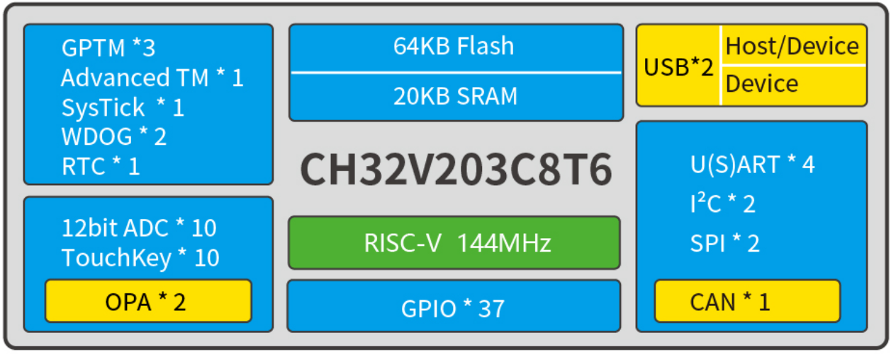
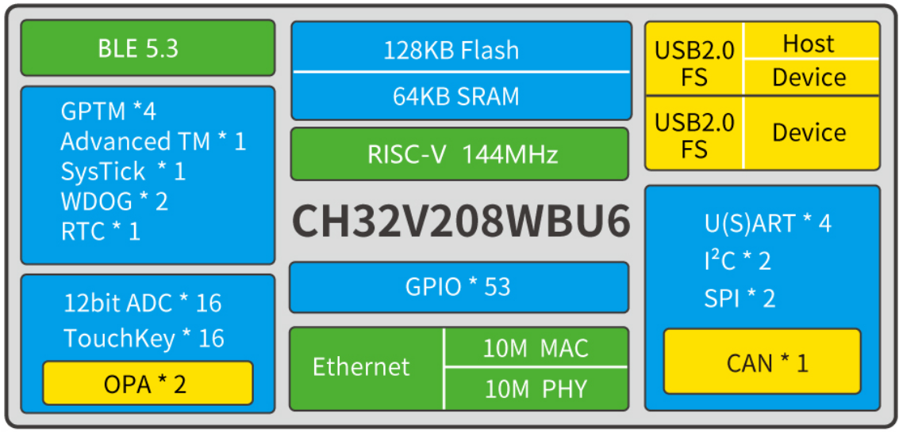

# 32-bit Enhanced Low-Power RISC-V MCU – CH32V203
EN | [中文](README_zh.md)

### Overview
The CH32V203 is an industrial-grade enhanced low-power general-purpose MCU based on 32-bit RISC-V core. The CH32V203 features high performance, and supports up to 144MHz system clock frequency. The operating power consumption can be as low as 45uA/MHz. CH32V203 integrates 2-channel USB interface which supports USB Host and USB Device functions. The CH32V203 provides 1-channel CAN interface (2.0B active), 2-channel OPA, 4 UARTs, 2 IICs, 12-bit ADC, 10-channel TouchKey and other peripheral resources. Several packages such as TSSOP20, QFN28 QFN48, LQFP32 and LQFP48 are available for users.

### System Block Diagram

 
### Features
- Qingke V4B, up to 144MHz system clock frequency;
- Single-cycle multiplication and hardware division;
- 20KB SRAM, 64KB Flash;
- Supply voltage: 2.5V/3.3V. GPIO unit is supplied independently;
- Low-power modes: sleep/stop/standby;
- Down to 44.65uA/MHz in Run mode;
- Down to 17.90uA/MHz in Sleep mode;
- Power-on/power-down reset (POR/PDR), programmable voltage detector (PVD);
- 1 x 18-channel general DMA controllers
- 2 amplifiers;
- 10-channel 12-bit ADC, 10-channel TouchKey;
- 4 timers;
- One USB2.0 full-speed host/device interface;
- One USB2.0 full-speed device interface
- 4 UARTs;
- One CAN interface (2.0B active);
- 2 IIC interfaces, 2 SPI interfaces;
- 37 I/O ports, can be mapped to 16 external interrupts;
- CRC calculation unit, 96-bit unique ID;
- Serial 2-wire debug interface;
- Packages: TSSOP20, QFN28, QFN48, LQFP32, LQFP48;

# 32-bit Wireless RISC-V MCU – CH32V208

### Overview
The CH32V208 is a wireless MCU based on 32-bit RISC-V core, with hardware stack area and fast interrupt entry. Compared with standard RISC-V, the interrupt response speed is greatly improved. The CH32V208 is based on V4C core. The memory protection unit is added and hardware division cycle is reduced. The CH32V208 integrates 2Mbps BLE communication module, 10M Ethernet module (MAC+PHY), USB2.0 full-speed device and host/device interface, CAN controller, etc.

### System Block Diagram

### Features
- Qingke V4C processor, up to 144MHz system clock frequency;
- Single-cycle multiplication and hardware division;
- 64KB SRAM, 128KB Flash;
- Supply voltage: 2.5V/3.3V. GPIO unit is supplied independently;
- Low-power modes: sleep/stop/standby;
- Bluetooth Low Energy 5.3;
- 10M Ethernet controller (MAC+PHY);
- Power-on/power-down reset (POR/PDR), programmable voltage detector (PVD);
- 2 amplifiers;
- 16-channel 12-bit ADC, 16-channel TouchKey;
- 5 timers;
- USB2.0 full-speed host/device + device interface;
- 4 USARTs;
- One CAN interface (2.0B active);
- 2 IIC interfaces, 2 SPI interfaces;
- 53 I/O ports, can be mapped to 16 external interrupts;
- CRC calculation unit, 96-bit unique ID;
- Serial 2-wire debug interface;
- Packages: LQFP64M, QFN68, QFN48, QFN28;

